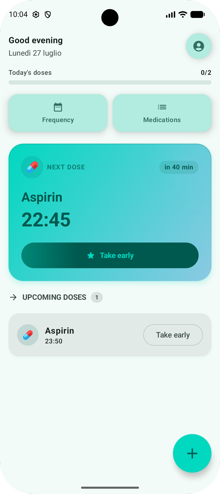
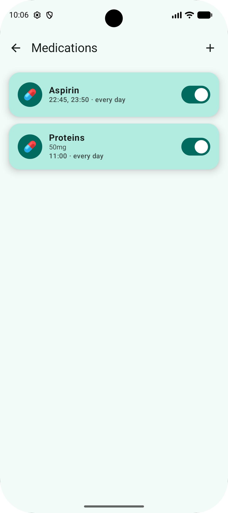
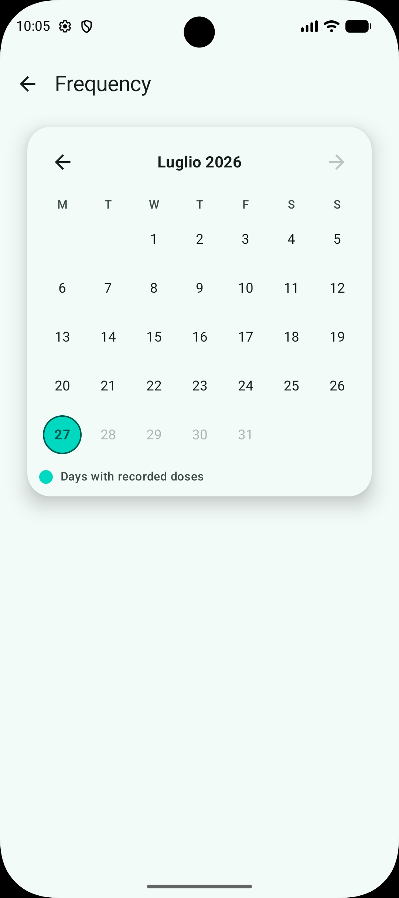
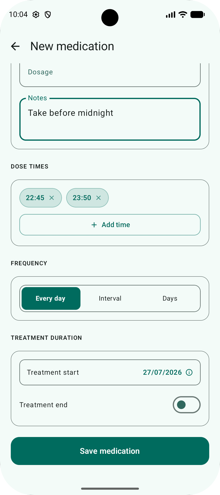

<div align="center">

# 💊 PillsOClock

**Never miss a dose again.**

Native Android app to remind you of medication doses throughout the day,
with exact reminders even when the app is closed.


-orange)


</div>

---

## 📖 Overview

**PillsOClock** is a **single-user** Android app (no login, one profile per
installation) designed for people managing multiple medications with
different schedules and frequencies. On the home screen the user sees at a
glance the doses due for today, can mark them as taken with a tap, and gets
an exact push notification right on time — even if the phone is in Doze mode
or the app has been closed. Every dose taken remains visible in the history,
even if the medication is later edited, paused, or deleted.

## ✨ Key features

- 🏠 **Smart home screen** — next dose, overdue doses, and upcoming doses
  grouped separately, with a daily adherence bar.
- 🔁 **Flexible dosing schedules** — daily, every N days, or on specific days
  of the week, with one or more times per medication.
- 📅 **Frequency & history** — calendar with the days on which doses were
  recorded, with drill-down into each day's detail.
- 🔔 **Exact reminders** — precise push notification via `AlarmManager`
  (`setExactAndAllowWhileIdle`), surviving reboots and process termination.
- 🌙 **Dark mode** — preference persisted with Preferences DataStore.
- 🗑️ **Soft delete everywhere** — deactivating/deleting a medication or a
  time slot never erases the history of doses already taken.
- ⏱️ **Confirmation window** — mark a dose as taken early, on time (±5 min),
  or late, with animated confirmations.

## 📸 Screenshots

|                 Home                 |                    Medications                     |                   Frequency                    |             Add medication             |
|:------------------------------------:|:--------------------------------------------------:|:----------------------------------------------:|:--------------------------------------:|
|  |  |  |  |

## 🏗️ Architecture

Layered architecture with a clean separation between domain and
persistence/UI details, MVVM on the presentation side, and **manual
dependency injection** (no framework like Hilt):

```
domain/
├── model/          → pure data classes, zero Android/Room dependencies
└── repository/     → repository interfaces (contracts)

data/
├── local/
│   ├── entity/     → Room entities (@Entity)
│   └── dao/        → @Dao interfaces
├── mapper/         → EntityX.toDomain() / DomainX.toEntity()
└── repository/     → concrete implementations (*RepositoryImpl)

ui/
└── <screen>/       → Composable + ViewModel + ViewModelFactory
```

Repositories are exposed as `lazy` properties on `PillsOClockApp`
(`Application`), and manually injected into each screen's
`ViewModelFactory`. Daily generation of scheduled doses is handled by
**WorkManager** (periodic worker + one-shot on first launch), while exact
reminders go through **AlarmManager**: two complementary mechanisms, not
alternatives.

## 🛠️ Tech stack

| Category | Library | Version |
|---|---|---|
| Language | Kotlin | 2.3.21 |
| UI | Jetpack Compose (BOM) + Material 3 | 2026.06.01 |
| Navigation | Navigation 3 (`androidx.navigation3`) | 1.1.4 |
| Persistence | Room | 2.8.4 |
| Background/scheduling | WorkManager | 2.11.2 |
| Exact notifications | AlarmManager (Android SDK) | — |
| Preferences | DataStore Preferences | 1.1.1 |
| Route serialization | Kotlinx Serialization | 1.11.0 |
| Analytics | Firebase Analytics (BOM) | 34.16.0 |
| Codegen | KSP | 2.3.9 |
| Supporting UI | ConstraintLayout Compose | 1.1.1 |
| Splash screen | AndroidX Core SplashScreen | 1.2.0 |

## 📋 Requirements

- **minSdk** 27 (Android 8.1 Oreo)
- **compileSdk / targetSdk** 37 / 36
- **AGP** 9.2.0
- Android Studio with Kotlin 2.3.x support

## 🚀 Setup & build

Standard Gradle commands, run from the repo root:

```bash
# Build & install
./gradlew assembleDebug          # build debug APK
./gradlew installDebug           # build and install on connected device/emulator

# Unit tests (local JVM)
./gradlew test

# Instrumented tests (requires device/emulator)
./gradlew connectedAndroidTest

# Android lint
./gradlew lint
```

<div align="center">

Made with 🧡 in Kotlin & Jetpack Compose

</div>
